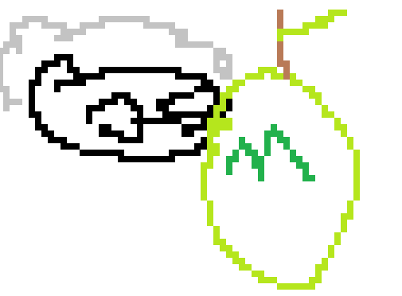

# granny smith manufacturing

> [!WARNING]
> this doesnt even work yet its complicated

the biggest most massive level editor of all time for the biggest most massive mobile game smash hit by mediocre ab granny smith by mediocre ab

see also [KnShim](https://codeberg.org/knot126/KnShim)

## usage

don't.

## building

A building or edifice is an enclosed structure with a roof, walls and often windows, usually standing permanently in one place, such as a house or factory. Buildings come in a variety of sizes, shapes, and functions, and have been adapted throughout history for numerous factors, from building materials available, to weather conditions, land pric...

`go run .`
